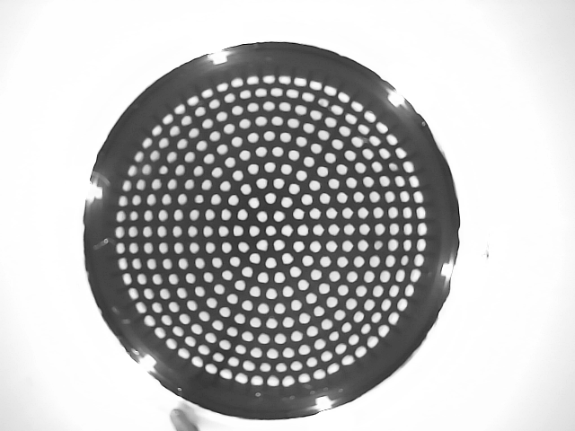
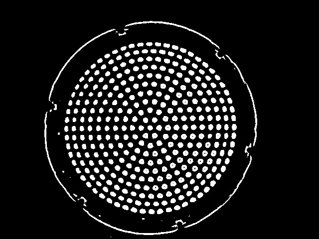
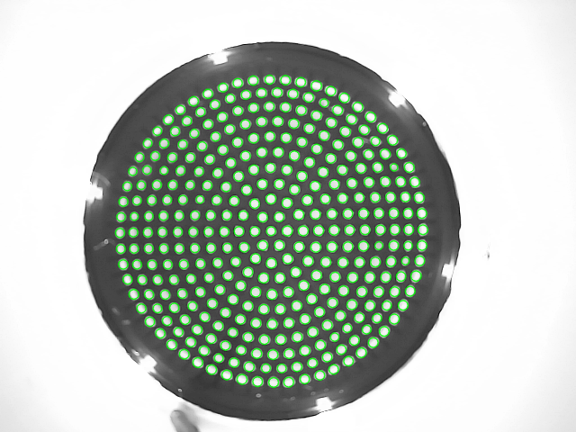
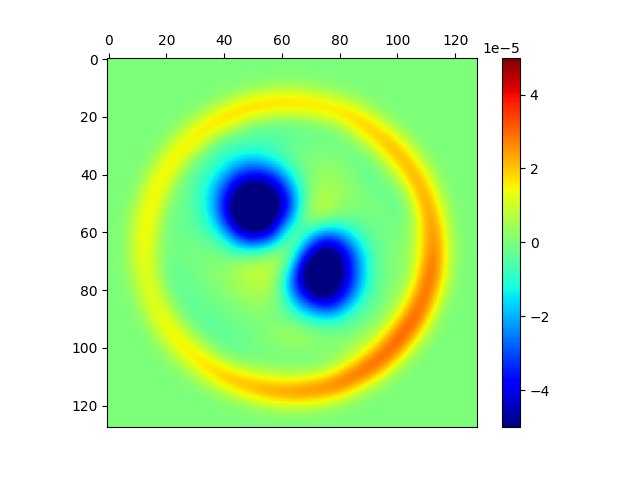
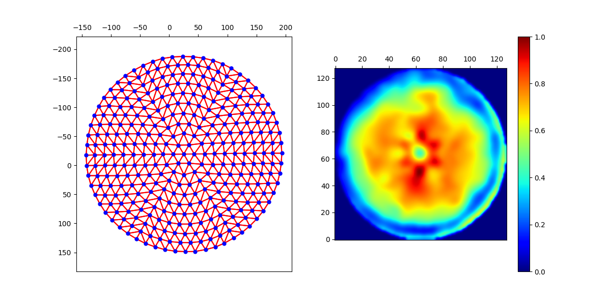

# Tactile Image Processing

This repos contains a collection of tools and utility functions for processing tactile images from the TacTip sensor.

<p align="center">
	
	
	
	
	
</p>

### Content ###
- [Installation](#installation)
- [Image Processing](#image-processing)
- [Marker Extraction](#marker-extraction)
- [Kernel Density](#kernel-density)
- [Voronoi Tesselation](#voronoi-tesselation)
- [Additional Info](#additional-info)


### Installation ###

```
git clone https://github.com/dexterousrobot/tactile_image_processing
cd tactile_image_processing
pip install -e .
```

All demonstrations in this repo are intended to be run with a live TacTip sensor. Please connect a sensor before running. The correct camera source will also need to be set.

### Image Processing ###

<p align="center">
	
	
</p>


A collection of tools for processing tactile images can be found in ```python image_transforms.py```. These are commonly used functions for processing tactile images into more consistent and reliable form. Additional, some functions useful for augmentation during training of conv nets are included.


This can be run with
```
python image_transforms.py
```

### Marker Extraction ###

<p align="center">
	
	
</p>

This can be run with
```
python marker_extraction_methods.py
```


### Kernel Density ###

<p align="center">
	
	
</p>

This can be run with
```
python kernel_density.py
```

### Voronoi Tesselation ###

<p align="center">
	
	
</p>

This can be run with
```
python voronoi.py
```


### Additional Info ###

If you use this project in your work, please cite

```

@InProceedings{...}

```